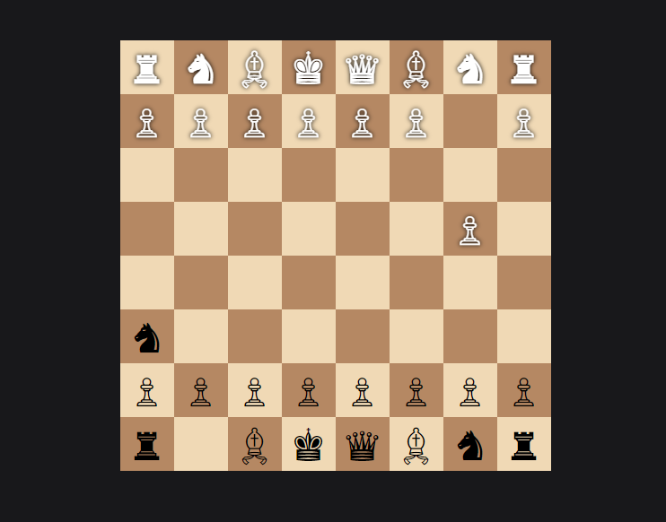

# Chess Game 🎮♟️

Welcome to the **Chess Game** project! This is a real-time multiplayer chess game built with modern web technologies, allowing players to connect and play chess online. This project utilizes **Node.js**, **Express**, **Socket.IO**, and **Chess.js** to provide a seamless and interactive chess-playing experience.

## Table of Contents

- [Features](#features)
- [Screenshots](#screenshots)
- [Getting Started](#getting-started)
  - [Prerequisites](#prerequisites)
  - [Installation](#installation)
- [Usage](#usage)
- [Project Structure](#project-structure)
- [Contributing](#contributing)
- [License](#license)

## Features

- 👫 **Multiplayer**: Play chess with another player in real-time.
- 📜 **Move Validation**: Ensures all moves are legal as per chess rules.
- 🔄 **Board Flipping**: Automatically flips the board for black player.
- 🚶 **Spectator Mode**: Allows additional users to join as spectators.
- 🚀 **Drag and Drop**: Intuitive piece movement using drag-and-drop interface.
- 💻 **Responsive Design**: Adapts to different screen sizes for a great experience on all devices.

## Screenshots


_Chess Board Interface_

## Getting Started

Follow these instructions to set up the project on your local machine.

### Prerequisites

- **Node.js**: Ensure you have Node.js installed. You can download it from [here](https://nodejs.org/).

### Installation

1. **Clone the repository**:

   ```sh
   git clone https://github.com/yourusername/chess-game.git
   cd chess-game
   ```

2. **Install dependencies**:

   ```sh
   npm install
   ```

3. **Run the server**:

   ```sh
   npm start
   ```

4. **Open the game in your browser**:

   Navigate to `http://localhost:3000` in your web browser.

## Usage

- **Start a Game**: Open the URL in two separate tabs or share it with a friend. The first user will be assigned the white pieces, and the second user will be assigned the black pieces.
- **Move Pieces**: Drag and drop pieces to make moves. The game ensures all moves are valid.
- **Spectate**: Any additional users who join will be spectators and can watch the game in real-time.

## Project Structure

```plaintext
.
├── public
│   ├── css
│   │   └── styles.css       # CSS for styling the chessboard
│   ├── js
│   │   └── chessgame.js     # Client-side
├── views
│   └── index.ejs            # EJS template for the main page
├── app.js                   # Main server-side application
├── package.json             # Project metadata and dependencies
└── README.md                # Project documentation
```
